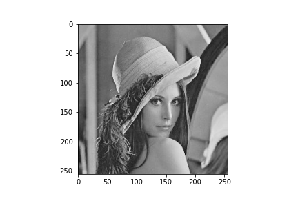
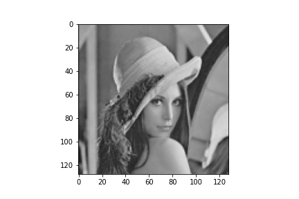
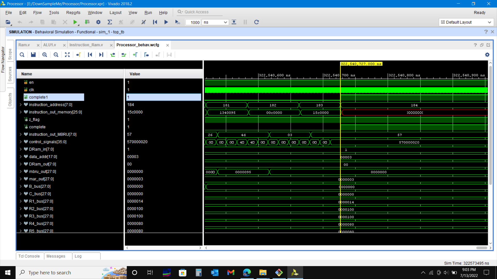
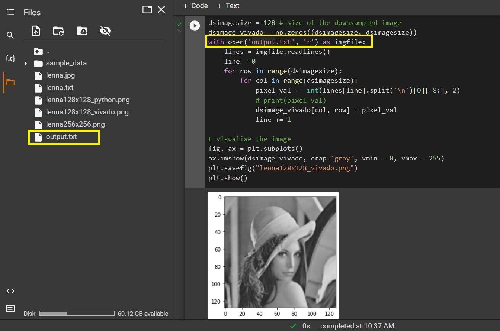
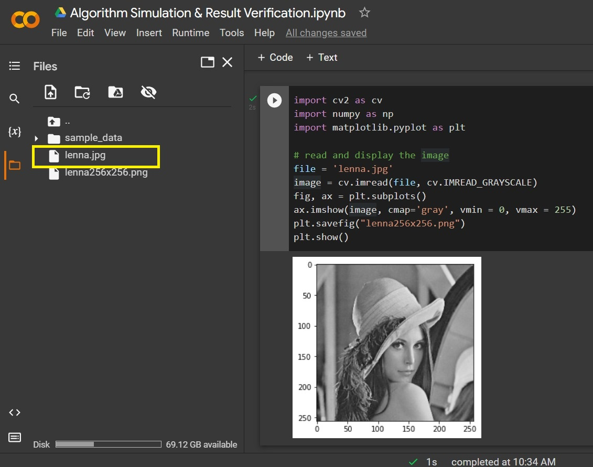
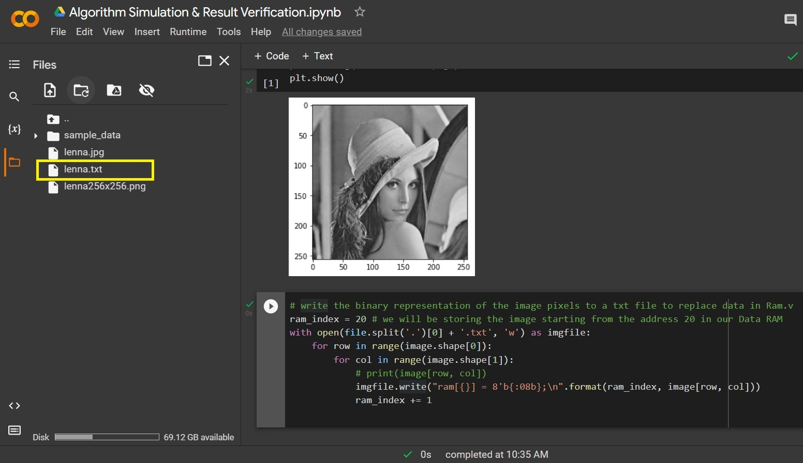

<!-- PROJECT LOGO -->
<br />
<div align="center">
  <a href="https://github.com/bimalka98/DownSampleMe">
    
  </a>

  <h3 align="center">©DownSampleMe</h3>

  <p align="center">
    An FPGA based Image Down Sampler
     <br />
    <a href="https://docs.google.com/document/d/1XCWUJ5JvQ-9f8b33Wkm8cP1w8nkovFviKMQTcKhzpn4/edit?usp=sharing"><strong>Explore the docs »</strong></a>
    <br />    
  </p>
</div>


## About The Project

This repository includes all the project files related to the development of a `Custom processor in Verilog HDL` for image downsampling. The project was done by a team of 4 undergraduates at the Department of Electronic and Telecommunication Engineering, University of Moratuwa, Sri Lanka. It was done as a pratial fulfillment of the requirements of UOM's EN3030 Circuits and Systems Design module.

The primary objective of this project was to design a Microprocessor and a CPU (Central Processing Unit) which can downsample a given `256x256` greyscale 8-bit image and generate correct results. The coding was done using Verilog Hardware Description Language (HDL).   `Xilinx Vivado` was used as the analysis and synthesis tool for the design of the processor and for the simulation of Verilog HDL designs.

|*Input Image*|*Output Image*|
|:----:|:----:|
|  ||

## Getting Started

### Run the simulation with the pre configured settings (default image)

1. `Processor` directory includes the latest working version of the processor which was tested and run successfully in `Xilinx Vivado 2018.2`. The design is therefore not tested on any of the previos versions of the software.
2. To simulate the processor, open Vivado software. Then use its `Open Project` wizard to open the `Processor.xpr` file locatd in the `Processor` directory.
3. Once the project is loaded, run the simulation. If the simulation is successful you will see a waveform similar to that of the below figure with the `complete1`. signal `HIGH`.

<div align="center">
  <a href="https://github.com/bimalka98/DownSampleMe">
    
  </a>
</div>

4. Once the simulation is complete, it will generate a text file named `output.txt` in the  `DownSampleMe` directory. It contains the 1D binary representation of the  resultatnt down sampled image of the original image that we have input to the simulation. 
5. To visualize the output image, open [this (Google Colab Notebook)](https://colab.research.google.com/drive/1eE8Q8uIJxuyx-AW62uAcI1w39IIY_8qK?usp=sharing), upload the   `output.txt` file to colab's file system and run the cell depicted in the below figure.

<div align="center">
  <a href="https://github.com/bimalka98/DownSampleMe">
    
  </a>
</div>

### Change the input image

1. Open [this (Google Colab Notebook) ](https://colab.research.google.com/drive/1eE8Q8uIJxuyx-AW62uAcI1w39IIY_8qK?usp=sharing), upload a `256x256` image file to colab's file system and run the cell depicted in the below figure. This will load the required image to the notebook.

<div align="center">
  <a href="https://github.com/bimalka98/DownSampleMe">
    
  </a>
</div>

2. Then run the next immediate cell, to generate the verilog compatible format of the image. This will create a new text file named `<your_image_name>.txt` as shown in the figure given below.

<div align="center">
  <a href="https://github.com/bimalka98/DownSampleMe">
    
  </a>
</div>

3. Copy everything in that `<your_image_name>.txt`  file by pressing `Ctrl + A` and replace the following code lines (starting from `ram[20]` to `ram[65555]`) in the `Ram.v` file. This file can be opened using the vivado 's bult-in editor. Once the lines are replaced, save the file and run the simulation again.

```
ram[20] = 8'b10100101;
ram[21] = 8'b10100001;
ram[22] = 8'b10011101;
ram[23] = 8'b10011101;
ram[24] = 8'b10100001;
          :
          :
          :
ram[65550] = 8'b01000101;
ram[65551] = 8'b01010010;
ram[65552] = 8'b01011101;
ram[65553] = 8'b01100110;
ram[65554] = 8'b01101100;
ram[65555] = 8'b01101110;        
```
4. Follow the same steps mentioned previously to visualize the new output.

## Resources

* **Assembly Code of the downsampling algorithm**: [Google Doc](https://docs.google.com/document/d/1R5cfxfUcxFAjJ8fZj0wsmnxjtsEuOZJe5kcvPTRPmB8/edit?usp=sharing)

* **Look Up Table for the Control Unit**: [Google Sheet](https://docs.google.com/spreadsheets/d/1cPLsKdqjS8sBTy0h7B8eG3x53jNWrn1y6RE4xuYMAvU/edit?usp=sharing)

* **Python Scripts**: [Google Colab Notebook](https://colab.research.google.com/drive/1eE8Q8uIJxuyx-AW62uAcI1w39IIY_8qK?usp=sharing)

##  Contributors

* [Kumarasinghe H.A.N.H](https://github.com/nikeshi99)
* [Mendis N.P.A.](https://github.com/pahanmendis)
* [Nagasinghe K.R.Y.](https://github.com/Ravindu-Yasas-Nagasinghe)
* [Thalagala B.P.](https://github.com/bimalka98)
