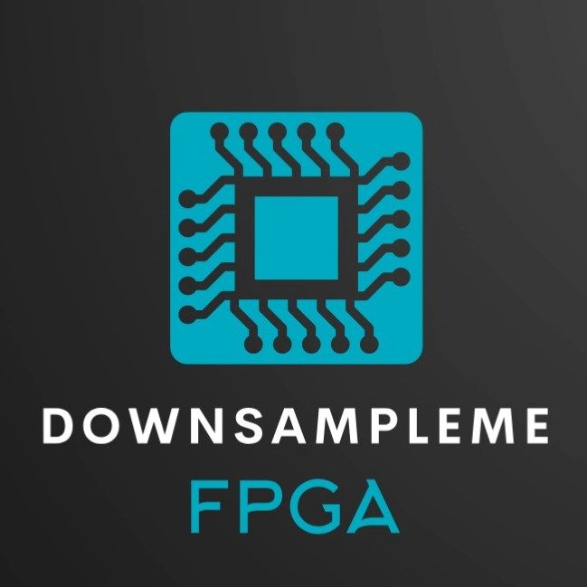

<!-- PROJECT LOGO -->
 

  

  <h3 align="center">©DownSampleMe</h3>

  

    An FPGA based Image Down Sampler
      
    <a href="https://github.com/bimalka98/DownSampleMe"><strong>Explore the docs »</strong></a>
         
  

## About The Project

This repository includes all the project files related to the development of a `Custom processor in Verilog HDL` for image downsampling. The project was done by a team of 4 undergraduates at the Department of Electronic and Telecommunication Engineering, University of Moratuwa, Sri Lanka. It was done as a pratial fulfillment of the requirements of UOM's EN3030 Circuits and Systems Design module.

The primary objective of this project was to design a Microprocessor and a CPU (Central Processing Unit) which can downsample the given `256x256` greyscale 8-bit image and generate correct results. The coding was done using Verilog Hardware Description Language (HDL).   `Xilinx Vivado` was used as an analysis and synthesis tool for the design of the processor and for the simulation of Verilog HDL designs.

## Getting Started

## Resources

* **Instructions**: [Google Doc](https://docs.google.com/document/d/1028hsUJKepAL6kfoBulOBk_25bebY80FS1wIMX07NTk/edit?usp=sharing) (using the custom ISA Instruction Set Architecture)

* **Look Up Table for the Control Unit**: [Google Sheet](https://docs.google.com/spreadsheets/d/1q-KNqPpNZ8ltx9Im-CNCMf2_ZTri1Vfy2qa3QgV4cFc/edit?usp=sharing)

* **Python Scripts**: [Google Colab](https://colab.research.google.com/drive/1c3xVg8fkw7t2A_alm5TcAHl4fj6NBz4B?usp=sharing)

##  Contributors

* [Kumarasinghe H.A.N.H](https://github.com/nikeshi99)
* [Mendis N.P.A.](https://github.com/pahanmendis)
* [Nagasinghe K.R.Y.](https://github.com/Ravindu-Yasas-Nagasinghe)
* [Thalagala B.P.](https://github.com/bimalka98)
